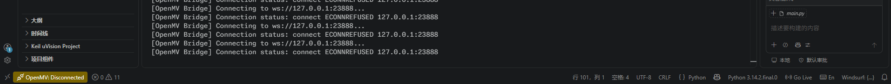
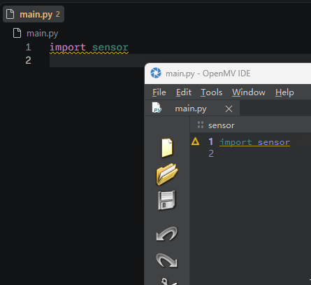
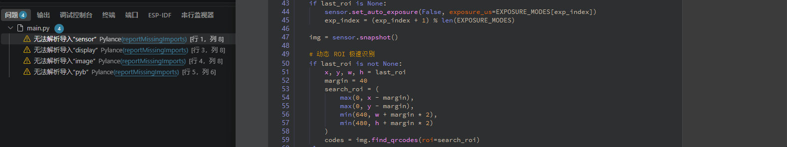
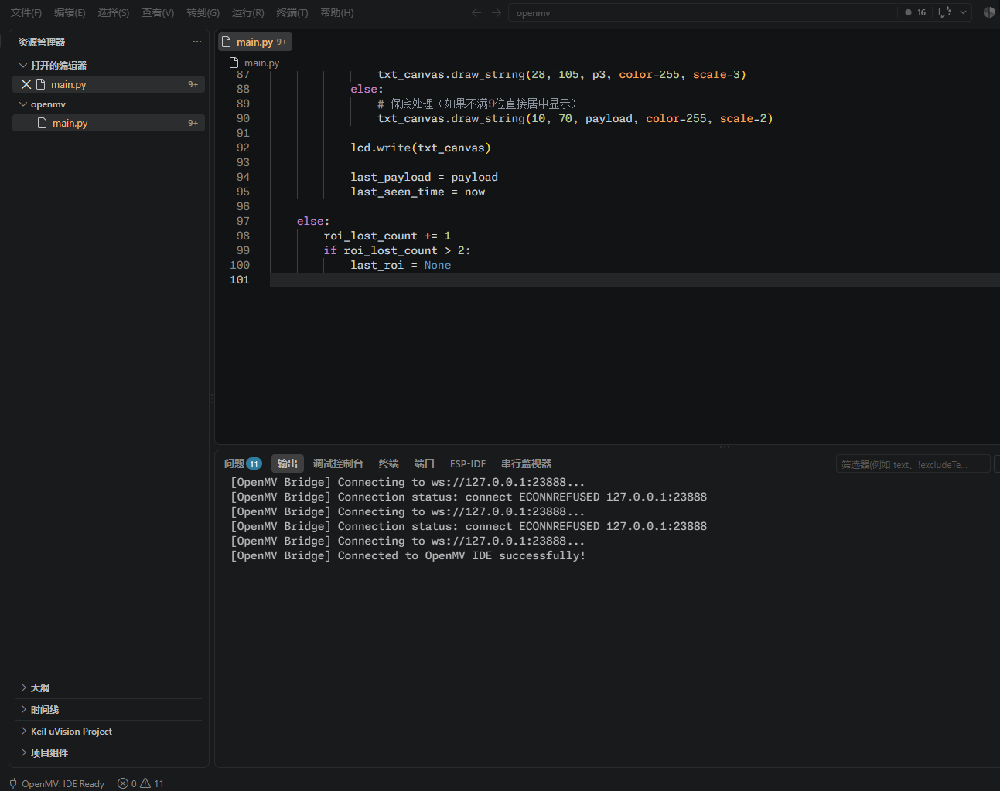

<div align="center">


# OpenMV IDE & VS Code Bridge (Enhanced Edition)

**跨编辑器协同 · 代码双向快速同步 · 串口流式终端 · 语法警告与报错诊断投射**

[](LICENSE)
[]()
[](vscode-openmv-bridge/)
[](release/)

</div>

---

## 📖 项目简介

**OpenMV IDE & VS Code Bridge** 是专为嵌入式机器视觉开发者打造的跨编辑器双向协同开发系统。

传统的 OpenMV 脚本开发往往受限于嵌入式 IDE 的代码编辑体验（缺乏现代化的补全、重构、多光标、丰富的主题与插件生态）。本项目通过在 **OpenMV IDE** 底层注入高性能无感 WebSocket 桥接引擎，并配合专门开发的 **VS Code Bridge 扩展插件**，彻底实现了：

> 💡 **“用 VS Code 写现代化 Python 代码，用 OpenMV IDE 连相机看图像与调试视觉算法”** —— 两者互联，双向同步！

---

## 🌟 核心特性与功能演示

### 1. 🔌 跨编辑器一键快速连接
- 启动 OpenMV IDE 后，VS Code 插件会自动探测并迅速建立本地 WebSocket 桥接通道。
- VS Code 左下角状态栏实时呈现连接状态与当前连接的相机 COM 端口。

<div align="center">
  
</div>

---

### 2. 🔄 双向代码快速同步
- **打字空闲检测**：键盘高速输入时自动进入独占防扰状态，停笔后（800ms）平滑同步，**不丢字、不覆盖正在输入的代码**。
- **光标与视口平滑保持**：在 OpenMV IDE 接收外部更新时自动锁定当前光标位置与滚动条高度，**代码区屏幕无跳动**。
- **零弹窗干扰**：源码底层彻底移除了 Qt Creator 默认的 "File Changed on Disk" 模态冲突对话框，无需每次按 `Ctrl+S` 手动保存即可静默更新。

<div align="center">
  
</div>

---

### 3. 🔍 MicroPython 语法警告与报错诊断投射
- OpenMV IDE 内置的 MicroPython 语法检查器（LSP/Linter）所发现的语法错误、警告、未定义变量等信息，会实时同步映射到 VS Code 的 **Problems（问题面板）** 与编辑器代码行内红色波浪线高亮。

<div align="center">
  
</div>

---

### 4. 📟 串口终端双向数据流与 REPL 交互
- 相机运行过程中所有的 `print()` 打印输出会实时无损转发到 VS Code 的 **OpenMV Terminal (伪终端)** 与 **Output Channel**。
- 支持直接在 VS Code 终端内输入字符与相机板载 MicroPython REPL 进行交互控制。

<div align="center">
  
</div>

---

### 5. ⚡ VS Code 快捷菜单
- 点击 VS Code 状态栏的 OpenMV 图标或按下快捷键即可呼出快捷动作菜单：
  - 🖥️ **Show OpenMV Terminal**：呼出 OpenMV 专属交互式终端；
  - 🔄 **Reconnect to OpenMV IDE**：一键强制重连桥接通道；
  - 🧹 **Clear Problems / Diagnostics**：一键清理所有语法错误标记；
  - 🗑️ **Clear Serial Output**：一键清空串口终端输出缓冲区。

<div align="center">
  
</div>

---

## 📥 快速下载与安装 (Quick Start)

### 1. 下载预编译成品
直接前往本仓库的 [`release/`](release/) 文件夹或 GitHub Releases 下载：
- 🛠️ **OpenMV IDE 增强版安装包**：`openmv-ide-windows-5.0.1.exe`
- 🧩 **VS Code 桥接扩展安装包**：`openmv-bridge-1.0.1.vsix`

### 2. 安装 VS Code 扩展插件
在 VS Code 中按下 `Ctrl+Shift+X` 打开扩展视图，点击右上角 `...` 菜单选择 **“从 VSIX 安装... (Install from VSIX...)”** 并选取 `openmv-bridge-1.0.1.vsix`；  

### 3. 日常开发使用流程
1. 启动 **OpenMV IDE** 并点击左下角连接图标连接您的 OpenMV 摄像头；
2. 在 **VS Code** 中打开存放脚本的工作区文件夹（例如打开 `main.py`）；
3. VS Code 状态栏左下角将显示 `$(circuit-board) OpenMV: Connected`；
4. 现在您可以在 VS Code 中尽情编写代码，OpenMV IDE 负责实时显示帧缓冲区图像与视觉调试，两端代码即写即同！

---

## ⚙️ 插件配置项 (Extension Settings)

可在 VS Code 的 `settings.json` 中自定义以下配置项：

| 配置项 | 类型 | 默认值 | 说明 |
| :--- | :---: | :---: | :--- |
| `openmvBridge.serverUrl` | `string` | `ws://127.0.0.1:23888` | OpenMV IDE 内部 WebSocket 桥接服务器地址 |
| `openmvBridge.autoConnect` | `boolean` | `true` | 启动 VS Code 时是否自动连接 OpenMV IDE |
| `openmvBridge.enableDiagnostics` | `boolean` | `true` | 是否同步 OpenMV IDE 的代码语法错误与警告到 VS Code |
| `openmvBridge.enableSerialMonitor` | `boolean` | `true` | 是否将 OpenMV 串口数据流转发到 VS Code 终端 |

---

## 🛠️ 源码编译与二次开发 (Build from Source)

### 编译 OpenMV IDE (Windows x64)
- **编译工具链要求**：Qt 6.5.3 (MinGW 11.2.0 64-bit), CMake 3.25+, Ninja, Python 3.8+。
```powershell
# 克隆仓库及子模块
git clone --recursive https://github.com/ZKY-DW-Wait-me/openmv-ide.git
cd openmv-ide

# 编译并生成免签名安装包与绿色版
python make.py --no-sign-application --no-sign-installer
```
编译产物位于：
- 绿色免安装运行路径：`build/install/bin/openmvide.exe`
- 独立安装程序路径：`build/openmv-ide-windows-5.0.1.exe`

### 编译 VS Code 扩展
```powershell
cd vscode-openmv-bridge
npm install
npm run compile
npx vsce package --allow-missing-repository
```

---

## 📄 开源许可证 (License)

- OpenMV IDE 修改版源码继承官方开源许可：**GPL-3.0 License**。
- VS Code 桥接扩展源码遵循：**MIT License**。
